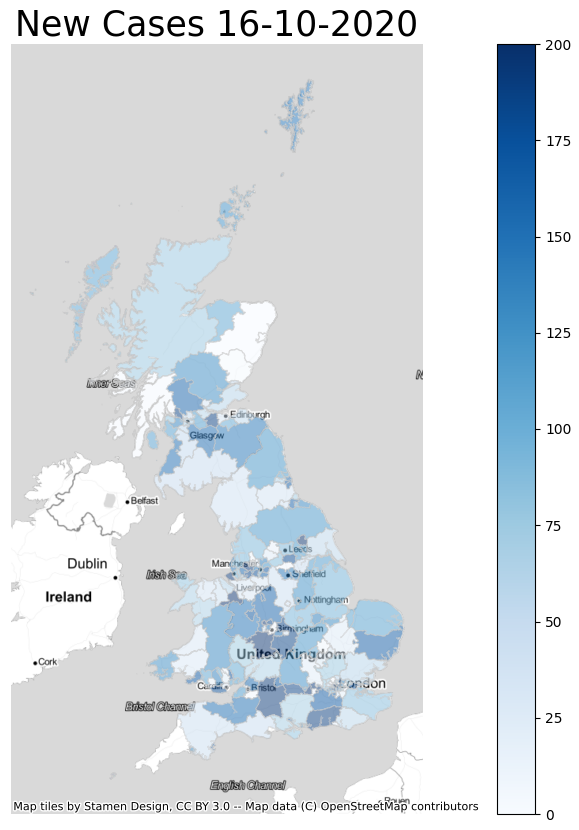

# Static Chloropleth Maps Using Geopandas and Pyplot
A brief guide on how to create static html, pdf or png maps of a chosen variable broken down by a chosen geography level using the python programming language and supporting libraries. 

Author: Richard Haigh

Date of Intial Upload: 19/10/2020

Written - Python 3.8.6

Environment: PyCharm 2020.2.3

Packages:
Geopandas 0.8.1, numpy 1.19.2, pandas 1.1.2, folium 0.11.0, contextily 1.0.1, matplotlib 3.3.2, Fiona 1.8.17, GDAL 3.1.3

This is intended to be a guide for analysts and statisticians with a mid-level knowledge of Python and programming fundamentals that will aid them in 
creating customised static maps in a format that would be suitable for enhancing statistical reports with attractive data visualisations. Use this if you wish for a pdf or png output file that shows your desired geography level breakdown (be it LA, DZ or SPC) and wish to shade each geog area by a given variable such as population, wealth or any other quantifiable numeric measurement. 

You can use this with an existing dataset providing it has a breakdown of your chosen geography level. You must also have access to the software stated above and 
the ESRI shapefiles of your chosen geography. These are too large to host on github repositories but can be found at spatialdata.gov.scot. 

As an example, we will map new Covid19 cases diagnosed on the 16th October 2020 across UK upper tier local authorities. Using this guide, you can quickly create ouptut such as this without using any licensed mapping software, such as QGIS or Arc:

